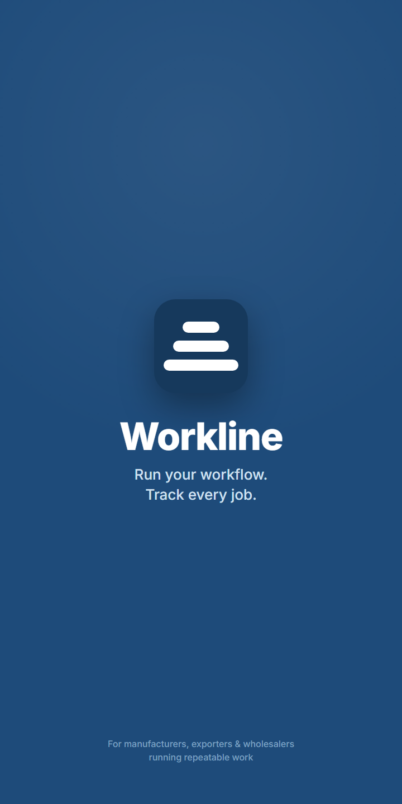
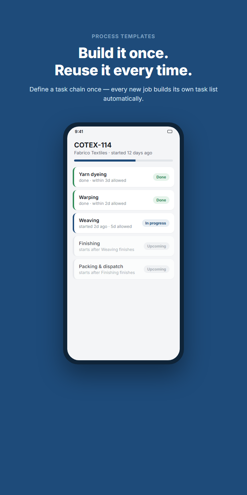
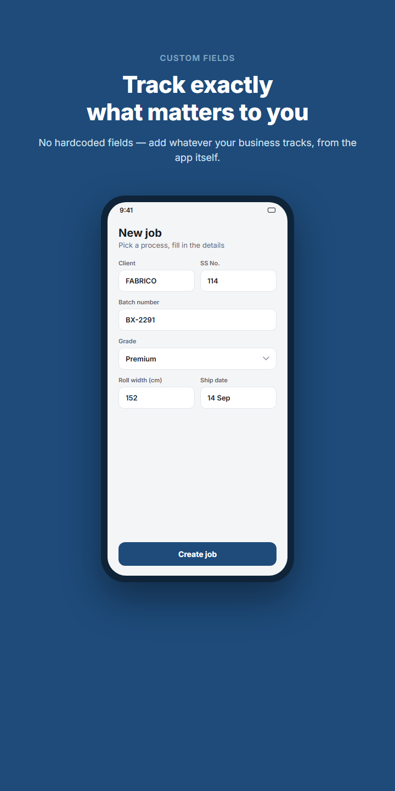
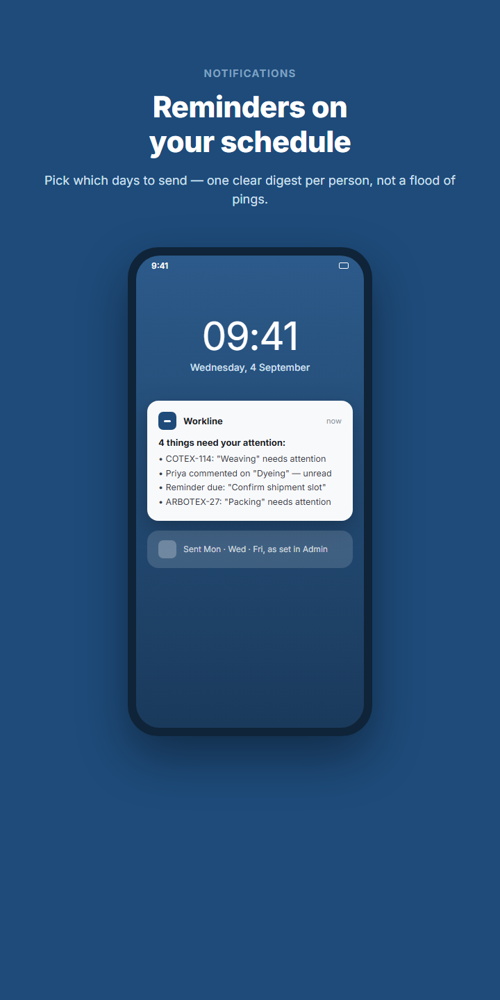
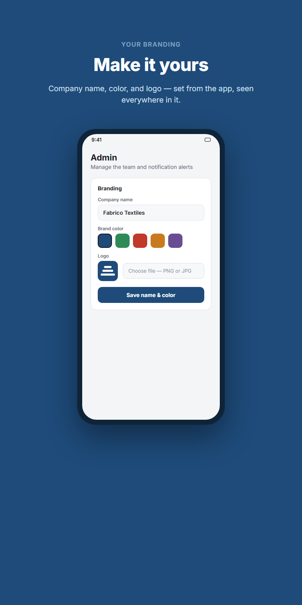

# Workline

**Self-hosted process tracking for businesses that run the same workflows, over and over.**

---

## What it is

Workline tracks jobs through a fixed sequence of tasks — who owns each step,
how long it's allowed to take, what depends on what — and keeps everyone
notified without anyone having to chase anyone else down.

It's built around one idea: **most of what a business tracks per job is
specific to that business**, so almost nothing here is hardcoded. Admins
define the process, the fields, and the branding; the app does the rest.

## Who it's for

Businesses that run **the same handful of workflows across many repeating
jobs** — the value is in defining a process once and reusing it hundreds of
times:

- Manufacturers and fabricators
- Exporters and trading houses
- Wholesalers and distributors
- Garment, textile, and food production
- Print shops and light-assembly operations

**Not a fit for:** project-based or bespoke work — agencies, software
studios, construction, consulting — where every engagement has a different
structure and a saved template buys you nothing.

## Screenshots

<table>
<tr>
<td width="20%" align="center"> <b>Process templates</b> define the task chain once</td>
<td width="20%" align="center"> <b>Custom fields</b> track what your business needs</td>
<td width="20%" align="center"> <b>Notification digests</b> on the days you choose</td>
<td width="20%" align="center"> <b>Your branding</b> name, color, logo</td>
</tr>
</table>

## Features

- **Process templates** — a chain of tasks with dependencies (some start
  after the previous one finishes, some once it merely starts), each with
  an owner and a days-allowed budget. Every new job is instantiated from
  one of these, with its own planned-vs-actual timeline.
- **Custom job fields** — whatever your business actually tracks per job (a
  batch number, a grade, a width, anything) as text, number, date, or a
  managed dropdown. Add, remove, and reorder fields from the Admin screen
  at any time — nothing is hardcoded to one industry.
- **Comments & reminders** — comment on any job or task; leave a dated
  reminder for whoever holds a task, separate from ordinary comments, that
  stays visible until resolved.
- **Scheduled push digests** — pick which days of the week notifications go
  out; each person gets one clear digest of their stale tasks, unread
  comments, and due reminders — not a ping per item.
- **In-app branding** — company name, brand color, and logo, uploaded right
  from the Admin screen. Updates the login screen, header, favicon, and PWA
  home-screen icon everywhere, for everyone, immediately.
- **Realtime sync** — every open session updates live as the team works;
  no refreshing.
- **Excel exports** — a full data backup and a client-facing status report,
  both `.xlsx`, both reflecting whatever custom fields you've defined.

## How it's built

A single static HTML file (vanilla JS, no build step, no framework) talking
directly to a small [Supabase](https://supabase.com) backend — Postgres,
auth, realtime, and Edge Functions all in the one free-tier project. Push
notifications run through a scheduled Edge Function and the standard Web
Push API. There's no server of your own to run or maintain.

**No app store either.** The app is installed via "Add to Home Screen" — a
real PWA, its own icon, full-screen, working push notifications — which
costs nothing and needs no store review. See [below](#wanting-a-real-app-store-listing)
if you want one anyway.

## Setup

You'll need a free [Supabase](https://supabase.com) project and a free
[Netlify](https://netlify.com) site. Ten-ish minutes, no credit card. The
path is: **get the code → set up the database → deploy it → everyone
installs it on their phone.**

### 0. Get the code

Click **Use this template** above (or **Code → Download ZIP**, or
`git clone` this repo) to get your own copy. Everything below happens in
that copy — nothing is shared with anyone else's deployment.

### 1. Database

Supabase Dashboard → your project → **SQL Editor** → New query → paste the
entire contents of [`schema.sql`](schema.sql) → **Run**.

Supabase Dashboard → your project → **SQL Editor** → New query → paste the
entire contents of [`schema.sql`](schema.sql) → **Run**.

### 2. Push notifications

1. Generate a VAPID keypair — easiest via `npx web-push generate-vapid-keys`
   (needs Node; no install required with `npx`), or any VAPID key generator.
2. Supabase Dashboard → **Edge Functions** → create a function named
   `send-reminders` → paste in [`send-reminders.ts`](send-reminders.ts) →
   Deploy.
3. That function needs four secrets (Edge Functions → `send-reminders` →
   Settings, or `supabase secrets set` via CLI):
   - `VAPID_PUBLIC_KEY`, `VAPID_PRIVATE_KEY` — from step 1
   - `SUPABASE_URL`, `SUPABASE_SERVICE_ROLE_KEY` — Project Settings → API
     (the **service role** key, not the anon key — this function needs to
     read/write across every person's data, which the anon key's RLS
     policies deliberately don't allow)
4. Edit the `mailto:admin@example.com` line near the top of
   `send-reminders.ts` to a real contact address for this deployment
   before deploying — required by the Web Push spec.
5. Schedule it to run at least daily: Supabase Dashboard → **Database** →
   **Cron Jobs** → new job, e.g. `0 6 * * *` (06:00 UTC, every day),
   command `select net.http_post(url:='<your function URL>');`. The
   function itself decides whether today is actually one of the days the
   admin picked in-app — it's safe to invoke daily regardless of how often
   you actually want notifications sent.

### 3. The app itself

Open [`index.html`](index.html) and fill in, near the top of the `<script>`
block:
- `SUPABASE_URL`, `SUPABASE_ANON_KEY` — Project Settings → API (the
  **anon/publishable** key here, never the service role key)
- `PUBLIC_VAPID_KEY` — the public key from step 2.1

### 4. Deploy

Drag a folder containing **both** `index.html` and `sw.js` into Netlify's
Deploys tab (or connect a git repo — either works). `sw.js` must be
deployed alongside `index.html` at the site root, or push notifications
silently stop working — easy to miss since everything else keeps working
fine without it.

### 5. First run

Open the deployed site. With no one set up yet, it'll prompt to create the
first admin account. From there: Admin → set your company name, brand
color, and logo; add your team; build your first process template; define
whatever job fields your business actually needs.

### 6. Everyone installs it on their phone

This is the step that turns the site into an app — its own icon, full
screen, no browser bar — and on iOS it's also what switches on push
notifications, which don't work there in a plain browser tab. Each person
does this once, on their own phone, after they can sign in:

**iPhone / iPad (Safari — must be Safari, not Chrome):**
1. Open your deployed URL in Safari and sign in.
2. Tap the **Share** icon (square with an arrow) in the toolbar.
3. Scroll down and tap **Add to Home Screen** → **Add**.
4. Open the app from the new home-screen icon (not Safari) from now on,
   and allow notifications when it asks.

**Android (Chrome):**
1. Open your deployed URL in Chrome and sign in.
2. Tap the **⋮** menu → **Add to Home screen** / **Install app** (or tap
   the install banner Chrome shows automatically).
3. Confirm **Install** — it now behaves like any other installed app,
   including notifications.

**Desktop (Chrome/Edge, optional):** an install icon appears in the
address bar — click it, or use the browser's menu → **Install Workline**.

## A note on data access

Every table uses one blanket policy: any signed-in team member can
read and write any row, including other people's comments, reminders, and
push subscriptions. There's no per-row ownership check. That's a deliberate
simplicity trade-off for a small trusted team, not an oversight — but know
it before self-hosting this for a team you don't fully trust with each
other's data.

## Wanting a real app-store listing?

Not something this project does centrally — a per-deployment app doesn't
map cleanly onto one store listing (see "How it's built" above). If a
specific deployment wants one anyway, wrapping a PWA for the Play Store
costs a one-time $25 Google Play developer fee (paid by whoever wants the
listing, not baked into this project) — [PWABuilder](https://pwabuilder.com)
can generate the wrapper from your deployed URL. Apple's App Store is
$99/year recurring and reviews thin PWA-wrapper apps more strictly, so it's
not recommended for a templated app like this.

## License

MIT — see [`LICENSE`](LICENSE).
